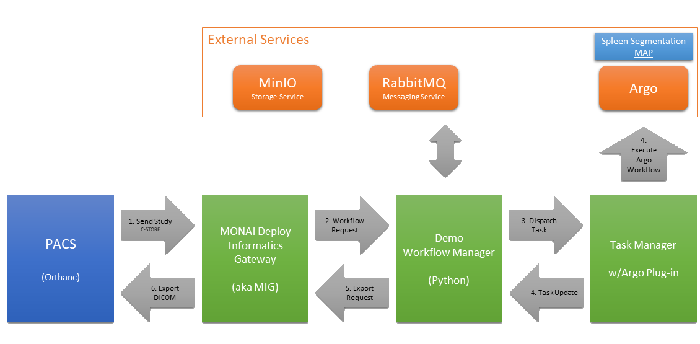

# DEMO: MONAI Deploy Informatics Gateway - Task Manager 

This demo integrates MONAI Deploy Informatics Gateway and the Task Manager using Argo plug-in to trigger an inference request.




## Requirements

- MONAI Deploy Informatics Gateway 0.1.1+
- MONAI Deploy App SDK 0.3+
  - A MAP from the [MONAI Deploy App SDK](https://github.com/Project-MONAI/monai-deploy-app-sdk/tree/main/examples/apps/) or BYO MAP. For this demo, we use the [Segmentation app](https://docs.monai.io/projects/monai-deploy-app-sdk/en/latest/getting_started/tutorials/03_segmentation_app.html).
- RabbitMQ configured and running
- MinIO configured and running
- Python 3.8+
- [MONAI Deploy Task Manager](https://github.com/Project-MONAI/monai-deploy-workflow-manager/tree/feature/53-dispatch-tasks/src/TaskManager)


## Running the demo

1. Install requirements specified above.
2. Deploy an Argo `kind:WorkflowTemplate` with a MAP. ([sample](./templates/WorkflowTemplateWIthMap.yml))
3. Configure Informatics Gateway:
   1. Configure an AET deployed in step 2. 
      For example, the following command would trigger the `segmentation-map` `kind:WorkflowTemplate` and use `segmentation` as the entrypoint to the Argo Workflow. (Please note the space between `segmentation-map` and `segmentation`.)
      ```
      mig-cli  aet add -a SPLEEN -w "segmentation-map" "segmentation"
      ```
   2. Configure source AE title.
   3. Configure destination AE title with your DICOM listener to receive results.
      This sample application exports files with `.dcm` extension only.
4. Install python dependencies specified in [requirements.txt](./requirements.txt)
   ```
   pip install -r requirements.txt
   ```
5. Edit `config.json` and change:
   1. `endpoint`/`host`, `username`, and `password` for both storage and messaging services.
   2. `baseUrl` for `argo`
   3. `bucket` where payloads are stored
7. Run demo app: python app.py
8. C-STORE DICOM dataset
   ```
   storescu -aec SPLEEN localhost 104 *.dcm
   ```

