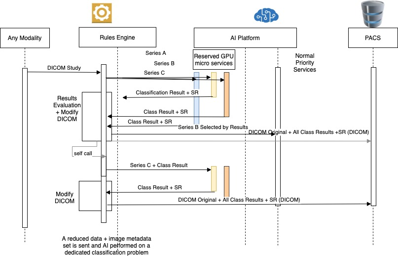
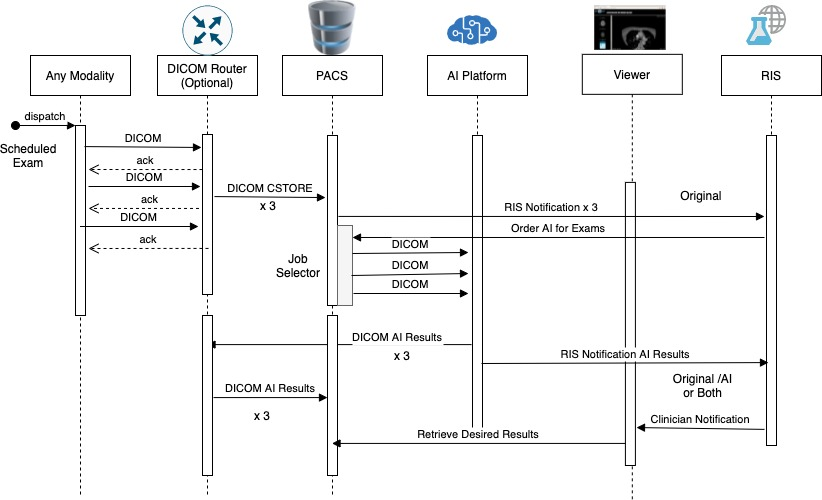
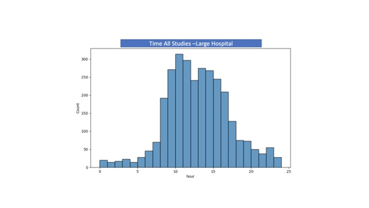

# MONAI Deploy Workloads

This is a proposal for the MONAI Deploy Working Group.

## Overview

This proposal documents the different clinical use cases and workloads that are relevant and can benefit from the use of AI.  This proposal further maps the clinical workflows and workloads  to computational workloads that generalize the requirements, so that they can be processed and implemented on system and software level.

[TOC]

### Goal {#goal}

The goal of this proposal is to provide clarity and introduce terminology, so that clinicians and data scientists working as part of AI deployment projects, can present their problem space on the correct level of abstraction. Software developers working on solutions for AI deployment should understand from this proposal the computational problems and map those to requirements that will drive their software development.

### Definitions {#definitions}

* **Clinical Use Case:** Defines the high level clinical use case where AI could be helpful.  _Example: Emergency brain hemorrhage diagnosis_
* **Clinical Workflow:** Defines the clinical workflow including the systems, data types and response times that describe the next level of detail for each clinical use case. 
* **Computational Workload:** Compute workload types for managing and processing Clinical Workloads.  
    * [Asynchronous Computational Workload](#asynchronous-computational-workload)
    * [Asynchronous Result Computational Workload](#asynchronous-result-computational-workload)
    * [Batch Computational Workload](#batch-computational-workload)
    * [Streaming Computational Workload](#streaming-computational-workload)
    * [Synchronous Computational Workload](#synchronous-computational-workload)

## Clinical Use Cases {#clinical-use-cases}

The clinical use cases introduced in this section are intended to be a non-exhaustive set of examples to provide enough clarity to help define scenarios where a MONAI Deploy application is used and a way to map those scenarios to workloads and components that developers use to understand compute needs and end to end performance constraints.  Each figure in this section is a sequence diagram described by the use case steps in the same section.

The clinical workflow is defined above. _Example: Incoming Images sent from the scanner via DICOM Router or PACS to be diagnosed.  AI algorithms help with Segmentation & Classification algorithms and create a new DICOM object including the results, so they can be uploaded to PACS.  Incoming study size: 500MB, response time requirement from imaging to result being available for radiologists 20 minutes.

### Quality Assurance {#quality-assurance}

#### Metadata Quality Assurance {#metadata-quality-assurance}

While studies are routed through the hospital DICOM routing infrastructure, images are validated with classification algorithms. Validating the usability of an image or data. Does the metadata associated with an image match the image? For instance, is this a left or right femur? The label states one direction but the image suggests another. These workloads allow for image corrections or create implied routing paths for further AI processing.

**Clinical Workflow**

1. Studies get routed in a large hospital DICOM routing system, at peak hour, the hospital is seeing about 300 studies per hour.
2. As series arrive to DICOM router, DICOM router sends selected slices out of the series an AI processing system
3. The AI processing system selects slices for classification based on DICOM metadata.
4. The AI algorithm evaluates the image metadata with the pixels and determines if the metadata (i.e. left shoulder) is indeed what the pixel data is showing (classification for left shoulder from image data).
5. After classifying the image the AI system sends a response back to the appropriate DICOM target location.
6. After receiving the response the DICOM router can route the image accordingly, either to the rejected queue for further analysis by QA technicians, or if everything looks good to the radiology work queue.

**Clinical Workflow (without DICOM Router)**

1. Studies are initiated on a modality and the DICOM is sent directly to a generalized application that ingests raw DICOM files.
2. The application will read the DICOM metadata and select a single image or slice from the series and send a significantly reduced dataset to the AI platform and algorithm specific for the QA study associated with the dataset. Note: in this example the reduction is in some aspect of the overall data set to simplify the AI processing complexity in proportion to the algorithm accuracy. In some variations, the application will send several image metadata and pixel sets in parallel to an AI platform and parse the results collectively.
3. The AI platform will evaluate the image metadata and pixels to validate the pair. In this example a classification solution is used and the results are sent back to the application.
4. After classification results are sent back to the application it adds metadata to the DICOM images that can be used later to filter the correct series of images for radiology studies. These DICOMs are added to the PACS along with the original data and made available to QA technicians.
5. Optionally and in addition to the previous action, the application can directly send corrected DICOM studies or augmented DICOMs to additional AI processing pipelines with different algorithms. 

**Clinical Use Case:** Study Metadata QA

**Computational Workload:**[Synchronous](#synchronous-computational-workload)

**Clinical Workload:** 400 studies per hour, 1,200 series per hour, 1 slice per series, response time requirement of less than 500 milliseconds per slice.

**Importance to Clinical AI Deployment:** critical, this type of inference is expected to be the most common across imaging, as it can drive a lot of other use cases downstream.

**Figure:** Study Metadata QA without DICOM Router

#### Image Quality Verification During Image Acquisition {#image-quality-verification-during-image-acquisition}

Help the radiology technician assure the image quality.  During an image acquisition a QA score is provided to the radiology technician to help validate if the image quality is sufficient and if imaging needs to be re-taken.  Typically seconds or 10’s of seconds matter for efficient, high quality imaging.

**Clinical Workflow**

1. A patient gets scheduled for a routine imaging for a CT image.
2. During image acquisition time, the radiology technician is watching the imaging proceed and parts of the study completes and are sent to the workstation.
3. As parts of the study complete, they get sent to an AI system for image quality verification.  The modality sends out parts of the DICOM study, one series at a time to an AI system.  Size of each series 512x512x100.  (CT, taking this is seconds, for MRI this is minutes). The modality is connected to an AI processing system via DICOM with a 1 gbps network connection. 
4. AI system analyses the arriving series images with a volumetric classification algorithm to notice if the patient is moving.  AI system creates a DICOM SR, including results.
<<<<<<< HEAD
5. If the AI system notices any anomalies in the image it The AI system sends the results (DICOM SR) to two locations, PACS and radiographers desktop computer a notification to the radiology technician about the QA score of the image. 
=======
5. If the AI system notices any anomalies in the image it sends the results (DICOM SR) to two locations, PACS and radiographers desktop computer a notification to the radiology technician about the quality assurance (QA) score of the image. 
>>>>>>> ba4e14a74c474eeca08845bcfbcf3d370fc28284
6. While monitoring the imaging the technician receives the notification about image quality score onto their desktop computer.  The technician notices the image QA score not being acceptable and decides to restart the imaging series. 

**Clinical Use Case:** Image Quality Verification

**Computational Workload Type:** [Asynchronous Result](#asynchronous-result-computational-workload)

**Clinical workload:** 1 request per series. CT exam 512 x 512 x 500.  Less than 610 seconds from image sent to modality to response being available to technician. 

**Importance to Clinical AI Deployment:** medium 

The implementation of AI, as part of image quality, will not directly impact patient care, but does improve efficiency and quality of hospital operations by reducing patient recall. Patient recall may increase hospital operation cost, lengthen the time for diagnosis and delay other patients evaluation of medical images.

**Figure:** Image Quality Validation

### AI Diagnostics {#ai-diagnostics}

#### Emergency Diagnostics {#emergency-diagnostics}

Immediate diagnostics required for emergency care: immediate processing is required for a rapid diagnosis of some emergent condition. These workloads have the patient either awaiting further imaging or other diagnostics. Seconds count for some emergency diagnostics situations (such as stroke, traumatic injury, and heart attack).

**Clinical Workflow**

A patient has been in a car accident and gets into the emergency room. 

1. The hospital orders an emergency CT imaging to be done on the patient's head to detect possible brain hemorrhage. Patient gets imaged with an emergency protocol.
2. The modality is connected to the hospital network on 1gbps connection and the CT study (512x512x600) gets sent to 2 different systems in parallel: 
    a. AI processing system.
    b. DICOM Router.
3. a) DICOM study gets processed by the AI processing engine, including pre-processing, inference and post processing.  The output of AI processing will be a probability score of the patient having brain hemorrhage.  The result will be packaged into a DICOM SR object.  The size of the resulting object will be 1 MB.  

    b) DICOM router sends the original study collected by the modality to be stored in PACS.  

4. AI processing engine sends the updated AI annotated study further to PACS via DICOM routing.  AI processing engine as a MIMPS notifies the RIS system about results completion.
5. DICOM router sends the study further to PACS. PACS/MIMPS notifies RIS about the AI diagnosis and the original study being ready in the radiology worklist.  
6. The radiologist on duty sees the case come up on top of their worklist denoting that new results are available or needs further attention.
7. The radiologist would be able to retrieve both the original DICOM image and either an annotated DICOM image or seperate report of the results depending on the design.   

**Clinical Use Case:** emergency diagnosis

**Computational Workload:** [Asynchronous Result](#asynchronous-result-computational-workload)

**Clinical workload:** 10-20 studies per day, study size 512x512x600

**Importance to Clinical AI Deployment:** high, the implementation of AI as part of emergency diagnosis will have a significant impact on emergency patient care, response requirement of 600 seconds.

**Figure:** Emergency Diagnosis Sequence

 

#### Scheduled Radiology Diagnostics {#scheduled-radiology-diagnostics}

Imaging studies get scheduled and analyzed by AI algorithms as part of the radiology workflow for diagnostic purposes.  These are often analyzed asynchronously: multiple images/studies are analyzed for scheduled clinical studies, research or pro-active diagnostics. Typically, in a clinical setting, the imaging has been scheduled and the patient will arrive at a predictable time so workload can be forecasted.  Clinicians or researchers will be consuming the results at a later time, typically minutes or hours after the imaging has been done.

**Clinical Workflow**

A patient has been scheduled for a radiology exam. 

1. The clinician orders CT imaging to be done on the patient's chest to detect issues with the lungs.
2. Study gets sent from the modality to the DICOM router.  The modality is connected to the hospital network on 1gbps connection and the CT study (512x512xnnn) gets sent to the DICOM router.  The data transfer requirement for this connection is best effort from image completion to when the study needs to be routed.  
3. DICOM router sends the original image to be stored in PACS and also in parallel routes a copy of the study to an AI processing engine.  DICOM router and AI processing engine are connected to each other with a high speed 10gbps network connection.  
4. DICOM study gets processed by the AI processing engine, including pre-processing, inference and post processing.  The output of AI processing will be a probability score of the patient having COVID-19.  The result will be packaged into a DICOM SR object.  The size of the resulting object will be the size of a DICOM image.  
5. AI processing engine sends the study further to DICOM routing.
6. DICOM router sends the study further to PACS 
7. PACS or the AI processing engine notifies RIS about the AI diagnosis being ready in the radiology worklist. 
8. The radiologist and/or physician responsible for ordering the study or reviewing the results sees the case come up on top of their worklist with both the original DICOM image and the AI provided scoring.  

**Clinical Use Case:** prospective diagnostics

**Computational Workload Type:** [Asynchronous](#asynchronous-computational-workload)

**Clinical workload:** 1,500 studies per day across all modalities with less 18 minutes per year of time required for manual intervention and less than 1% failures in processing.  Study size N x M x K depending on modality and requested study type.  See Table for estimates of study size to modality and study type mapping.

**Importance to Clinical AI Deployment:** high, the implementation of AI as part of scheduled radiology diagnosis will have a significant impact on patient care

**Figure:** Scheduled Radiology Sequence

#### Interactive Diagnostics During Image Reading  {#interactive-diagnostics-during-image-reading}

While a radiologist is reading a particular study, they request an AI algorithm to analyze it.

A time delay of 10 secs might be acceptable in _edge cases_, where the radiologist themselves needs a second opinion from fellow radiologists. 

**Classifying nodules (localised anomaly) in a 3D scan**

Imagine a 3D image where a radiologist only wants to get an inference on a small section of an image. The small section may be free hand drawn by the radiologist a selected 3D cube (or a 2D rectangular region). To streamline the process the original image is pre-fetched from PACS. An inference will be done only in the selected region. Annotating this region will generate a DICOM SR object and only the SR object will be sent to the inference engine. The inference can be done on the selected ROI and the results are then added to the DICOM record.   

**Inference on only a single image in a 4D DICOM Series**

Consider a scenario where AI segmentation is done only on the Left Ventricular Myocardium (LVM) only on the systolic and diastolic phases of the cardiac cycle. The problem here is both image segmentation and potentially using AI to select the ROI and the correct sub-images to process. 

Assume for now the radiologist can select which image from the series is to be used for inference. After selection the radiologist can provide information to the AI system on which image is to be used and the inference result (dicom seg) object can be sent as a reply. 

The assumptions for this use case include the streamlining of the amount of imaging information sent to the AI system for inference by either a manual process or in the future automated process.  Further, the expectation is that the communications and networking between the system components are fast enough to not be a significant portion of the overall turn around time for the use case.    

**Computational Workload Type:** [Streaming](#streaming-computational-workload)

**Clinical Workload:** response time less than 1 second

**Importance to Clinical AI Deployment:** medium

**Figure:** Interactive Diagnosis Image Reading

### Research and Development {#research-and-development}

#### Retrospective Study {#retrospective-study}

As part of AI model development, single AI algorithms are evaluated against existing studies stored in the PACS. In other cases, new datasets are made available and researchers look to gain new insights or data from an AI model to form a prospective diagnosis.  These studies will have on average greater than 10K units to be processed to satisfy statistical variety constraints and pool diversity requirements.  

**Clinical Workflow**

1. A researcher or model developer orders a selective batch of radiology exams to be processed with a specific AI model. 
1. Clinicians and researchers working on the algorithm AI model defines a cohort selection criteria and gathers a selection of patient and study IDs.
2. The DICOM router or some application with access to the PACs system has the ability to fetch data based on the selection criteria.  The application (either on DICOM router or externally) has the ability to send data to multiple devices efficiently.  In addition, the application has the ability to load balance and throttle the number of studies sent to a particular destination.    
3. DICOM router application requests the original DICOM study image from the PACS system at a rate of 8 studies per minute.  DICOM router and AI processing engine are connected to each other with a high speed 10gbps network connection.  
4. DICOM study gets processed by the AI processing engine, including pre-processing, inference and post processing.  The output of AI processing will return as an example will return a breast density score.  The result will be packaged into a report or optionally written on to a modified DICOM image.  The size of the resulting object will be the size of a DICOM image.  
5. AI processing engine sends the study further to DICOM routing.
6. DICOM router sends the study further to PACS, RIS or some external study result database.  
7. The researcher responsible for ordering the study or reviewing the results will review the AI platform success and failure rate for processing the images.  

**Clinical Use Case:** Group AI algorithm study

**Computational Workload:** [Batch](#batch-computational-workload)

**Clinical workload:** 1500 (check histograms)  studies per day for greater than 7 days with no manual intervention or study processing failures. study size N x M x K depending on modality and requested study type. See Table for estimates of study size to modality and study type mapping.

**Importance to Clinical AI Deployment:** high, the use case is crucial to getting models through regulatory approval and deployed clinically and making it general available will impact the usage of AI workflows.

**Figure:** Retrospective Study

### Clinical Workloads Summary {#clinical-workloads-summary}

| Workload                                   | Payload             | Pixels / Slice  | bpp | Response Time | Data Size     |
| ------------------------------------------ | ------------------- | --------------- | --- | ------------- | ------------- |
| Emergency Diagnostics                      | 1 study / 1  series | 512 x 512 x 100 | 16  | < 10 minutes  | ~260MB        |
| Scheduled Radiology                        | 1 Study             | 512 x 512 x 2000  | 16  | \> 30 minutes | ~780MB        |
| Interactive Diagnosis during Image Reading | 1 Study or 1 Series |                 |     |               |               |
| Image QA @ Acquisition                     | 1 Series            | 2048 x 2028     | 12  | \> 30 minutes | ~8MB          |
| Metadata QA                                | 1 series or 1 slice | 512 x 512       | 12  | < 500 ms      | ~2MB          |
| Retrospective Study                        | 100,000 Studies     | 512 x 512 x 600     | 16  | 7 days        | ~260MB x 1000 |

## Computational Workloads {#computational-workloads}
| Type         | Start        | Results      | Workload   |
| ------------ | ------------ | ------------ | ---------- |
| Synchronous  | synchronous  | synchronous  | Discreet   |
| Async Result | synchronous  | asynchronous | Discreet   |
| Asynchronous | asynchronous | asynchronous | Discreet   |
| Batch        | asynchronous | asynchronous | Expansive  |
| Streaming    | asynchronous | synchronous  | Continuous |

### Synchronous Computational Workload {#synchronous-computational-workload}

Work starts when a request is received. If the system cannot process the request immediately, an error is returned. Work must be completed before response timeout is reached; otherwise work is stopped and an error is returned. Results are returned as part of the response to the request.

Example workload(s):

* [Metadata Quality Assurance](#metadata-quality-assurance)

### Asynchronous Result Computational Workload {#asynchronous-result-computational-workload}

Work starts when a request is received. If the system cannot process the request immediately, an error is returned. A callback address is supplied as part of the request. Response is sent to the request indicating that work has started successfully.

Work completes after the initial request has completed. Once complete, the callback address provided as part of the initial request is used to send a completion notification.

Example workload(s):

* [Emergency Diagnostics](#emergency-diagnostics)

### Asynchronous Computational Workload {#asynchronous-computational-workload}

Work is enqueued for future processing when a request is received. Response to the request indicates if the work was successfully enqueued.

Work starts when the scheduler determines. Once the work completes, the callback address provided as part of the initial request is used to send a completion notification.

Example workload(s):

* [Scheduled Radiology Diagnostics](#scheduled-radiology-diagnostics)

### Batch Computational Workload {#batch-computational-workload}

Work is enqueued for future processing when a request is received. Response to the request indicates if the work was successfully enqueued.

Work starts with a parent-job, when the scheduler determines. The parent-job inspects the input dataset and generates child-jobs to process it. Each child-job is submitted via a new request. Child-jobs will be [asynchronous computational workloads](#asynchronous-computational-workload).

As each of the child-jobs completes, the callback address provided as part of the initial request is used to send a completion notification. Once all of the child-jobs have completed, the callback address provided as part of the initial request is used to send a final completion notification.

Example workload(s):

* Single patient DICOM series sent to multiple algorithms for prospective diagnosis.
* [Retrospective Study](#retrospective-study): cohort study of 10K patients sent to a single algorithm.

### Streaming Computational Workload {#streaming-computational-workload}

Work starts when a request is received. If the system cannot process the request immediately, an error is returned. Input is provided continuously as part of the request. Output is returned continuously as part of the response. The request completes when either end “hangs up” or disconnects.

Example workload(s):

* Image enhancement and overlay for ultrasound.

## Clinical Capacity Planning {#clinical-capacity-planning}

The clinical capacity needed for a typical large hospital or hospital system is used in determining the estimated computing workload seen at the system level.  The computing required will be allocated in one of the following ways based on the [clinical use cases](#clinical-use-cases).

1. Reserved capacity (always on) for QA type of use cases
2. Shared capacity (for emergency and scheduled radiology)
3. On-demand / R&D capacity for research workloads

The estimated number of machines per modality for a large hospital will vary significantly so  instead, the number of studies per modality per month data will be used to estimate a workload description for capacity planning.  

The estimated number of radiology exams per modality is provided from a few sources including data provided from three large hospitals across the US and in the UK as well as data from the UK National Health Service Diagnostic Information Dataset (DID) on RIS. 

Here are the modalities derived from the data sets in descending order of average number of studies per month.
| Modality                      | Other Terminology |
| ----------------------------- | ----------------- |
| Plain Radiography             | XR, X-Ray         |
| Diagnostic Ultrasonography    | US, Ultrasound    |
| Computerized Axial Tomography | CT, CAT           |
| Magnetic Resonance Imaging    | MR, MRI           |
| Fluoroscopy                   | FL                |
| Nuclear Medicine Procedure    | NM,               |
| Positron Emission Tomography  | PET               |

**Table:** Modalities in descending order of utilization

First, for a large hospital the estimated number of radiology exams per month based on data provided by a few large hospitals.  

**Figure:** Count of Imaging Activity by Monthly Modality in Large Hospitals

Next, the information provided by the UK National Health Service showing the Average Count of Imaging Activity by Modality.  In this dataset, 64 of the largest institutions by volume of radiology exams were selected and averages calculated.  

**Figure:** Average Count of Imaging Monthly Activity by Modality for 64 Large UK Hospitals

Further data provided shows that the clinical workloads are distributed throughout the day with the peaks occurring during the middle of the day between 8AM and 6PM as would be expected aligning with normal scheduling hours.  An example of this distribution is provided in Figure: Histogram of all radiology exams per hour.

**Figure:** Histogram of all Radiology Exams per Hour - Large Hospital

The data from large US hospitals show these peaks for number of studies to be around 300 studies (of all modalities) per hour.  For the UK data derived from the DID database, the monthly data is much larger in scale, so the hourly counts are expected to be higher as well even though the specific per hour break down is not provided.  

The data provides the relative ranking with respect to total monthly workloads based on modality and the percentage of these workloads relative to the overall number of imaging exams conducted. 

| Modality                      | % of Total |
| ----------------------------- | ---------- |
| Plain Radiography             | 50%        |
| Diagnostic Ultrasonography    | 22%        |
| Computerized Axial Tomography | 15%        |
| Magnetic Resonance Imaging    | 8%         |
| Fluoroscopy                   | 2%         |
| Nuclear Medicine Procedure    | 2%         |
| Positron Emission Tomography  | 2%         |
**Table**: Monthly Percentage of Modality imaging to total workloads using UK NHS DID dataset.

In fact, this distribution is statistically the same looking at the estimate of other major large US hospitals as well.  

An estimate for impact on data size and number of images per exam/study to be processed is provided by the following table:
|                     |                   |                    | File size uncompressed \[MB\] |           |              |                                            |
| ------------------- | ----------------- | ------------------ | ----------------------------- | --------- | ------------ | ------------------------------------------ |
| Modality            | Image size        | \# of images/study | Average                       | Range     | Modality mix | Data volume per 100,000 studies \[GB\] (6) | Percent distribution |
| Conv. Radiography   | 2,000 x 2,500 x 2 | 3                  | 30                            | 20–50     | 11.1%        | 333                                        | 8.8% |
| Digital radiography | 3,000 x 3,000 x 2 | 3                  | 54                            | 36–90     | 33.2%        | 1,793                                      | 47.5% |
| CT                  | 512 x 512 x 2     | 60                 | 32                            | 21–157    | 13.5%        | 432                                        | 11.4% |
| Multi-slice CT      | 512 x 512 x 2     | 500                | 262                           | 131–2,100 | 1.5%         | 393                                        | 10.4% |
| Mammography         | 4000 x 5000 x 2   | 4                  | 87                            | 35–208    | 7.1%         | 618                                        | 16.4% |
| MRI                 | 256 x 256 x 2     | 200                | 26                            | 11–131    | 6.7%         | 174                                        | 4.6% |
| Nuclear imaging     | 256 x 256 x 2     | 10                 | 1.3                           | 0.3–3.8   | 3.4%         | 4                                          | 0.1% |
| Digital fluoroscopy | 1,024 x 1,024 x 1 | 20                 | 20                            | 10–50     | 1.4%         | 28                                         | 0.7% |
| Ultrasound          | 640 x 480 x 1     | 30                 | 9.2                           | 6.1-18.4  | 22.1%        | 203                                        | 5.4% |
|                     |                   |                    |                               |           | 100.0%       | 3,775                                      | 100.0% |
**Table:** Modality Imaging data volume

1: Data as of 2009 (mammography data as of 2007)

2: X pixels x Y pixels x bytes/pixel

3: Smith E.: Storage management: What Radiologists Need to Know. Applied Radiology, May 2009

4: Pisano E. et al.: Issues to Consider in Converting to Digital Mammography. Radiol Clin North Am. 2007; 45(5): 813-vi

5: Assuming 70% small FOV and 30% large FOV studies

6: Uncompressed files sizes, not including backup and disaster recovery storage \
7: Credit J. Hancox for compiling data.

The workloads resulting from the use cases defined in the[ Clinical Use Case](#clinical-use-cases) section may use one or more of the modality workloads defined here based on the specific scenario under study.  E.g. for Quality Assurance Metadata Quality Assurance an image orientation classification AI algorithm using either plain radiology (Digital radiology, x-ray, computed radiology), Ultrasound, or Computerized Axial Tomography may be used to quickly determine whether the metadata is valid for a given image. 

The plain radiology modality workload represents ~50% of the Clinical use cases which are responsible for ~55% of the data volume processed (using assumptions in Modality Imaging data volume).  The ultrasound modality workload represents ~22% of the Clinical use cases which is responsible for ~5.4% of the data volume processed.  The CT modality workload represents ~15% of the clinical use cases and is responsible for ~21% of the data volume processed. 

Hardware to support AI for a combined workload for the modalities has traditionally varied. In general, IT infrastructure will assess the mix of modalities and clinical workloads based on the use cases to be supported.  Next, the appropriate mix and utilization method based on these clinical workloads will determine what hardware and compute resources are deployed. 

Typical hardware specifications to be used for the computational workloads are provided below based on specifications seen in the marketplace for AI deployments.

### Hardware Targets {#hardware-targets}
| System   | Hardware Specifications for AI Platform (representative)                                                                                                                                                                                                                                                                                                                                                      |
| -------- | ------------------------------------------------------------------------------------------------------------------------------------------------------------------------------------------------------------------------------------------------------------------------------------------------------------------------------------------------------------------------------------------------------------- |
| System A | 1U, dual socket rack system supports up to: Two Intel Xeon Scalable processors. Twenty four DIMM slots. Storage capacity of four Graphical Processing Units. A100 80GB Two power supply units (PSUs) Optional two 2.5-inch cabled SATA SSDs installed only in PSU 2 bay.                                                                                                                                      |
| System B | GPU Up to 4x NVIDIA GPUs RTX 30XX, RTX A6000, RTX A5000, RTX A4000, and Quadro RTX options Processor AMD Threadripper or Intel Core i9 Configurable up to 64 cores, 128 threads, and 256 MB cache Memory Up to 1 TB Fits up to eight 128 GB LRDIMMs at 3200 MHz OS drive Up to 2 TB 3,200 MB/s seq. read and 2,000 MB/s seq. write Extra storage Up to 61 TB Fits up to eight 7.68 TB SATA SSDs. Power supply |
## Appendix {#appendix}

### Clinical Workloads Out of Scope  {#clinical-workloads-out-of-scope}

For the purpose of this document, the following workloads are out of scope:

**Digital Pathology** 

Analyze pathology images with AI algorithms.

**Image Enhancement** {#image-enhancement}

Using computation and AI techniques, clarify the image for human and machine analysis.

**Medical Text Analysis:**

Natural language processing (NLP) used with medical notes producing coding and diagnostic assistance. For instance, validate that the medical regime is both safe and effective for this patient given known medical history. 

* Text analysis: Named Entity Recognition (NER) problems.

**AI Assisted Labeling (MONAI Label):**

AI assisted labeling is part of the training workflow. MONAI labeling assists a human trainer by suggesting areas to be labeled by inference. As training progresses, models may be updated for the inference engine.

**Speech Based Medical Coding:** 

Using natural language processing, transcribe and code the clinical notes. 

* Genomic Sequence Analysis :
* Drug Discovery :
* Training : 
* MONAI Stream : MONAI stream applications. Inference workloads that are being run over live streams of images. An example application would be ultrasound guided medical operations in a clinical setting. This is a highly latency sensitive workload with immediate, synchronous response expected. We expect that the analysis will need to take less than 100ms in order to be useful.

### Useful links {#useful-links}

* [MONAI Deploy Workloads Spreadsheet](https://docs.google.com/spreadsheets/d/12FAEPaLEBCye52Dms-hOLUTiFp1RhcW2m2avEsWar34/edit#gid=1202564085)
* [Additional Information from NHS on Modality Usage](https://www.england.nhs.uk/statistics/wp-content/uploads/sites/2/2021/09/Statistical-Release-16th-September-2021-PDF-809KB-1.pdf)
* [Clinical Reading Exam Reference Paper](https://arxiv.org/ftp/arxiv/papers/2009/2009.12437.pdf)
