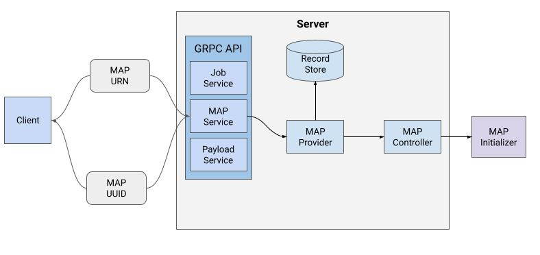
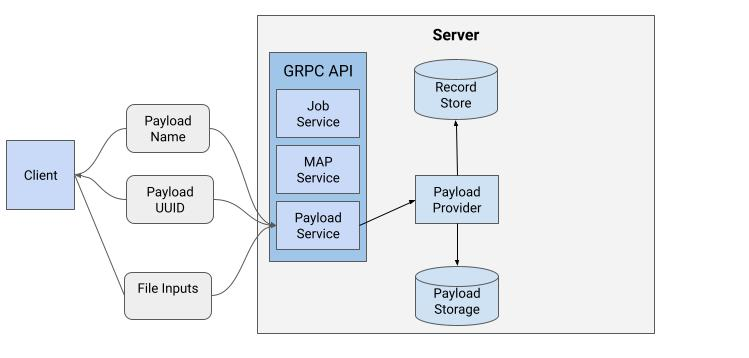
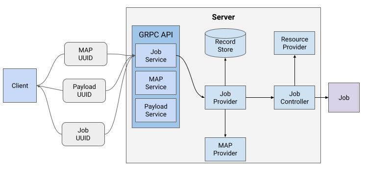
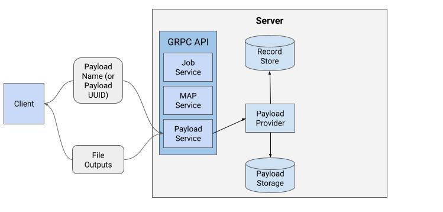

# MONAI Deploy Application Server Specification

## Description
This is a proposal for the MONAI Deploy Working Group for the MONAI Deploy Application Server.

- [Overview](#overview)
- [Goal](#goal)
- [Success Criteria](#success-criteria)
- [Requirements](#requirements)
  - [Support for Specific MONAI Workloads](#support-for-specific-monai-workloads)
  - [Deployable on MONAI Operating Environments](#deployable-on-monai-operating-environments)
  - [API Interface](#api-interface)
  - [Consistent and Robust Logging](#consistent-and-robust-logging)
  - [Register and unregister MAPs](#register-and-unregister-maps)
  - [List registered MAPs](#list-registered-maps)
  - [Describe registered MAP](#describe-registered-map)
  - [Upload Datasets](#upload-datasets)
  - [List Datasets](#list-datasets)
  - [Run MONAI applications with associated datasets](#run-monai-applications-with-associated-datasets)
  - [Provision resources for jobs](#provision-resources-for-jobs)
  - [Get job status](#get-job-status)
  - [Notify registered job handler about job completion](#notify-registered-job-handler-about-job-completion)
  - [Cleanup inputs associated with a completed job](#cleanup-inputs-associated-with-a-completed-job)
  - [Provide results of completed jobs](#provide-results-of-completed-jobs)
  - [List and filter jobs](#list-and-filter-jobs)
- [Design and Architecture](#design-and-architecture)
  - [Services](#services)
    - [MAP Service](#map-service)
    - [Payload Service](#payload-service)
    - [Job Service](#job-service)
  - [Core Workflow in Server](#core-workflow-in-server)
    - [MAP Registration](#map-registration)
    - [Uploading Job inputs](#uploading-job-inputs)
    - [Job Creation](#job-creation)
    - [Downloading Job payload](#downloading-job-payload)
- [Future Considerations](#future-considerations)

## Overview
As data scientists & applications developers build AI models they need a way to deploy these applications in production. MONAI Deploy Application Server will be used to deploy multiple MONAI applications. This proposal documents the requirements for MONAI Deploy Application Server.

## Goal
The goal for this proposal is to enlist, prioritize and provide clarity on the requirements for MONAI Deploy Application Server. Developers working on different software modules in MONAI Deploy Application Server (Server) SHALL use this specification as a guideline when designing and implementing software for the Server.

## Success Criteria
Authorized clients SHALL be able to communicate with the Server over the network with an API request. 

Authorized clients SHALL be able to register [MONAI Application Packages(MAP)](./monai-application-package.md) with the Server. 

Authorized clients SHALL be able to submit a job request to the Server for running a job corresponding to a MAP along with an input dataset. 

At a given time, multiple jobs can be run, depending on the system resources in the machine. 

On completion of jobs, results SHALL be made available to the authorized clients.

Authorized clients SHALL be able to request the Server for cleaning up any resources associated with a job that has finished running. 

## Requirements

### Support for Specific MONAI Workloads
Server SHALL be able to support specific versions of MONAI workloads as defined in [MONAI Workloads](./MONAI-Workloads.md).

Server SHALL be able to run specific MAP types as defined in [MONAI Application Package](./monai-application-package.md).

### Deployable on MONAI Operating Environments
Server SHALL run on MONAI Staging Server and MONAI Production Server environments as defined in [MONAI Operating Environments](./MONAI-Operating-Environments.md).

### API Interface
Server SHALL communicate with clients in a request-response format. Server SHALL include a status code with a response while processing a request. All authorized clients communicating with

### Consistent and Robust Logging
Server SHALL provide consistent and robust logging about it's operations. Server SHALL provide a default logging level along with a more verbose logging level.

### Register and unregister MAPs
Server SHALL allow authorized clients to register and unregister MAPs.

### List registered MAPs
Server SHALL allow authorized clients to list registered MAPs.

### Describe registered MAP
Server SHALL allow authorized clients to describe the configuration information of a MAP.

### Upload Datasets
Server SHALL allow authorized clients to upload datasets.
These datasets shall be managed by the Server.

### List Datasets
Server SHALL allow authorized clients to list upload datasets.

### Run MONAI applications with associated datasets
Server SHALL run MONAI applications with uploaded input dataset.

Server SHALL maintain associations made by authorized clients between input datasets and MONAI applications.

### Provision resources for jobs
Server SHALL provision CPU, memory, and GPU resources for jobs as defined in the MAP.

### Get job status
Server SHALL allow authorized clients to retrieve the status of a job.

### Notify registered job handler about job completion
Server SHALL notify registered job handler about job completion.

### Cleanup inputs associated with a completed job
Server SHALL allow authorized clients to inform the server to cleanup inputs associated with a job that has finished running.

### Provide results of completed jobs
Server SHALL allow authorized clients to download results of completed jobs.

### List and filter jobs
Server SHALL allow authorized clients to list all jobs while also providing filtering capabilities within the list in the form of MAP identifier, job status, job creation and completion timestamps.

## Design and Architecture

### Services

Server is composed of three [GRPC](https://grpc.io/) microservices.
- MAP Service
- Payload Service
- Job Service

Whenever an authorized client sends a request to any of these services, it will get an appropriate status code as a part of the response.

#### MAP Service
- Server SHALL provide an interface for authorized clients to interact with the MAP Service.
  - MAP Service SHALL provide an interface to register a MAP.
    - MAP registration SHALL require a [URN](https://www.rfc-editor.org/rfc/rfc8141.html) to the MAP's container.
    - MAP registration SHALL return a unique identifier for the registered MAP.
  - MAP Service SHALL provide an interface to unregister a MAP.
    - MAP unregistration SHALL require a unique identifier for the registered MAP.
  - MAP Service SHALL provide an interface to list all MAPs known to the Server.
    - MAP Service SHALL provide a mechanism to filter list results.
  - MAP Service SHALL provide a mechanism to name a known MAP.
    - MAP Service SHALL provide a way to remove a name from a MAP.
    - MAP Service SHALL provide a way to rename a MAP.
  - MAP Service SHALL provide an interface to get the status of a MAP registered with the Server.
    - Status retrieval SHALL require a unique identifier for the registered MAP.
    - Status retrieval SHALL return a list of manifests for the registered MAP.
    - Status retrieval SHALL return the state of the registered MAP.

#### Payload Service
- Server SHALL provide an interface for authorized clients to interact with the Payload Service.
  - Payload Service SHALL provide an interface to create a payload.
    - Payload creation SHALL return a unique identifier for the registered payload.
  - Payload Service SHALL provide an interface to upload files to a payload.
    - Uploading files to a payload SHALL require a unique identifier for the payload along with the path and contents of the file to be uploaded to the payload.
  - Payload Service SHALL provide an interface to download files from a payload.
    - Downloading files from a payload SHALL require a unique identifier for the payload along with the path of the file to be downloaded from the payload.
    - Downloading files from a payload SHALL return the path and contents of the file downloaded from the payload.
  - Payload Service SHALL provide an interface to remove files from a payload.
    - Removing files to a payload SHALL require a unique identifier for the payload along with the path of the file to be removed from the payload.
  - Payload Service SHALL provide an interface to delete the contents of a payload.
    - Payload deletion SHALL require a unique identifier for the Payload to be deleted.
  - Payload Service SHALL provide an interface to list all Payloads known to the Server.
    - Payload Service SHALL provide a mechanism to filter list results.
  - Payload Service SHALL provide a mechanism to name a known payload.
    - Payload Service SHALL provide a way to remove a name from a payload.
    - Payload Service SHALL provide a way to rename a payload.
  - Payload Service SHALL provide an interface to get the status of a created payload.
    - Status retrieval SHALL require a unique identifier for the created payload.

#### Job Service
- Server SHALL provide an interface for authorized clients to interact with the Job Service.
  - Job Service SHALL provide an interface to create a job.
    - Job creation SHALL require a unique identifier or name for a registered MAP to deployed as a job.
    - Job creation SHALL require a unique indentifier of a payload to be fed as input to the job.
    - Job creation SHALL return a unique identifier for the created job.
  - Job Service SHALL provide an interface to cancel a job.
    - Job cancellation SHALL require a unique identifier for the job to be cancelled.
  - Job Service SHALL provide an interface to delete a job.
    - Job deletion SHALL require a unique identifier for the job to be deleted.
  - Job Service SHALL provide an interface to finalize (cleanup input data associated with job) a job.
    - Job finalization SHALL require a unique identifier for the job to be finalized.
  - Job Service SHALL provide an interface to list all jobs known to the Server.
    - Job Service SHALL provide a mechanism to filter list results.
  - Job Service SHALL provide an interface to get the status of a job created with the Server.
    - Status retrieval SHALL require a unique identifier for the created job.
    - Status retrieval SHALL return the timestamp when the job was created.
    - Status retrieval SHALL return the timestamp when the job was started.
    - Status retrieval SHALL return the timestamp when the job was stopped.
    - Status retrieval SHALL return the timestamp when the job was finalized.

### Core Workflow in Server

#### MAP Registration

1. An authorized client requests the MAP Service to register a MAP.
2. MAP Service routes the request to the MAP Provider.
3. The MAP Provider requests the MAP Controller to deploy an instance of the MAP.
4. The MAP Controller launches a MAP Container and returns a unique identifier to the client.
5. The MAP Controller monitors the running container.
6. Once the container finishes execution, the MAP Controller reads the [manifests](./monai-application-package.md#manifests) from the output directory of the MAP and requests the MAP Provider to store the MAP manifests in the database.

#### Uploading Job inputs

1. An authorized client requests the Payload Service to create a payload.
2. The Payload Service routes the request to the Payload Provider to create a payload. 
3. The Payload Service returns the unique identifier of the created payload.
4. The authorized client uses the unique identifier to upload input files to that payload by sending a file upload request to the Server.
5. The Server routes the request to the Payload Provider to copy the file contents to the payload storage.

#### Job Creation

1. An authorized client requests the Job Service to run a job for a given MAP and payload input.
2. Job Service requests the Job Provider to run a job for the MAP image.
3. Job Provider retrieves the MAP manifests from the MAP Provider for the given MAP unique identifier.
4. Job Provider then requests the Job Controller to launch a job for the MAP selected by the client.
5. Job Controller confirms with the Resource Provider if sufficient resources(CPU, memory and GPUs) are available.
   1. If resources are unavailable, job creation is rejected by the Server and a status code is returned back to the client.
   2. If sufficient resources are available, Job Controller deploys the job and provides the uploaded inputs to the deployed container.
6. Job Provider then stores a record in the database for the newly launched job and the unique identifier of the job is returned back to the client.
7. Job Controller monitors the job, detects changes in job status and requests the Job Provider to set the updated status for the job.

#### Downloading Job payload

1. An authorized client requests the Payload Service to download a file within the payload.
2. Payload Service routes the request to the Payload Provider. 
3. Payload Provider retrieves the payload record from the database.
4. Payload Provider obtains the location of the payload in the payload storage from the record.
5. Payload Provider reads the file within the payload and passes the file stream to the Payloads Service which streams the contents back to the client.

## Future Considerations
In the future, support for non-file based payloads can be added to Server.
